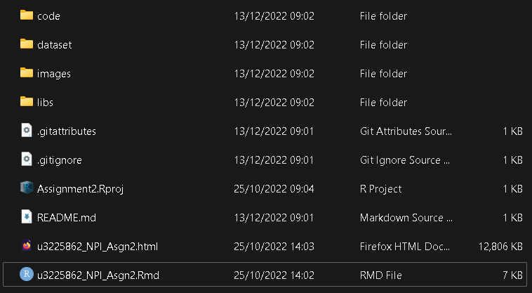

# Australian_Pollutants

 A revealjs presentation on Pollutant inventory of Australia

## Presentation

An R markdown based revealjs presentation. 

## Data Source

Australian Government's Pollution Inventory data : [National Pollutant Inventory](https://data.gov.au/dataset/ds-dga-043f58e0-a188-4458-b61c-04e5b540aea4/details)

Furthermore details can be found at:  [NPI](https://www.dcceew.gov.au/environment/protection/npi)

The data used in this draft is csv. Please download the csv files and place it in a folder named dataset.

## Folder Structure

Finally, the folder structure should look something like this,

* code has source R files to run some computations to display visualisations
* images have files created for visuals
* dataset should have the source csv files
* libs contain revealjs and other libraries for the presentation
